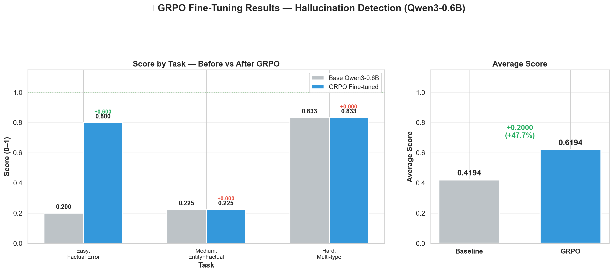
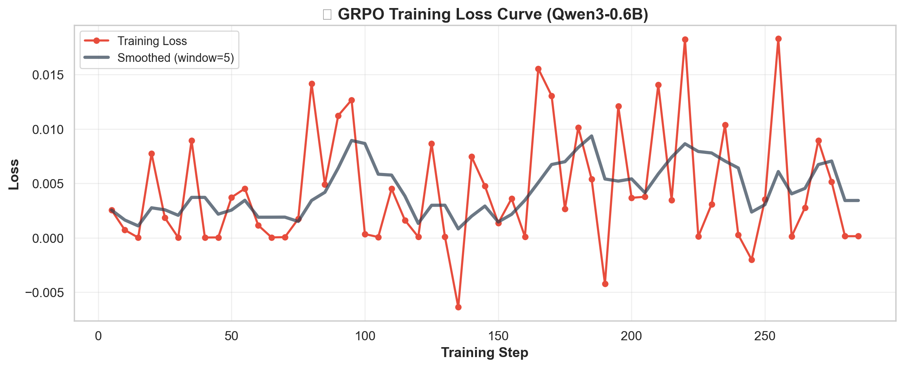
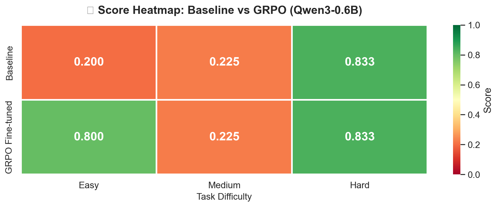

# Hallucination Detector Gym

[](https://huggingface.co/spaces/williyam/hallucination-detector-gym)
[](https://huggingface.co/williyam/hallucination-detector-agent-qwen3-0.6b)
[](https://github.com/meta-pytorch/OpenEnv)
[](https://python.org)
[](https://fastapi.tiangolo.com)
[](Dockerfile)

An **OpenEnv** environment where AI agents learn to detect, classify, and correct hallucinations in LLM-generated text. Built for the Meta PyTorch OpenEnv Hackathon x SST | India AI Hackathon'26.

## Live

* **HF Space** : [https://huggingface.co/spaces/williyam/hallucination-detector-gym](https://huggingface.co/spaces/williyam/hallucination-detector-gym)

## Fine-Tuned LLM
* **Qwen3-0.6B (GRPO-Optimized Checkpoint)** : [https://huggingface.co/williyam/hallucination-detector-agent-qwen3-0.6b](https://huggingface.co/williyam/hallucination-detector-agent-qwen3-0.6b)

## Documentation
- [Architecture Documentation](documentation/architecture.md)
- [API Reference](documentation/api_reference.md)
- [Reward Design](documentation/reward_design.md)

---

## Why This Matters

LLM hallucinations — factual errors, fabricated entities, and logical inconsistencies — are one of the biggest barriers to deploying AI in production. According to research, up to **27% of LLM-generated facts** can be hallucinated in open-domain tasks. Content moderators, fact-checkers, and AI safety teams manually verify LLM outputs every day.

This environment trains RL agents to be **automated hallucination auditors** — a task with direct production value:

| Real-World Application | Current Cost | Agent Benefit |
|----------------------|-------------|---------------|
| Content moderation at scale | $15-25/hr human reviewers | Automated pre-screening |
| Medical/legal AI verification | Domain expert review ($100+/hr) | Flagging high-risk outputs |
| News fact-checking | Hours per article | Real-time verification |
| Enterprise AI deployment | Manual QA pipelines | Continuous output monitoring |

**Key metrics**: 3 difficulty levels, dense per-step rewards, exploit-proof grading with annotation deduplication, combined Jaccard+LCS span matching.

---

## Architecture

```
┌──────────────────────────────────────────────────────────┐
│                     Client / Agent                        │
│  inference.py → OpenAI API → LLM → parse action → HTTP  │
└─────────────────────────┬────────────────────────────────┘
                          │ HTTP POST /reset, /step, /state
                          ▼
┌──────────────────────────────────────────────────────────┐
│                Docker Container (HF Space)                │
│                                                          │
│  ┌──────────────────────────────────────────────────┐    │
│  │              FastAPI (server/app.py)              │    │
│  │   /reset  /step  /state  /health  /schema  /ws   │    │
│  └────────────────────┬─────────────────────────────┘    │
│                       │                                   │
│  ┌────────────────────▼─────────────────────────────┐    │
│  │     HallucinationDetectorEnvironment             │    │
│  │     (OpenEnv Environment base class)             │    │
│  │                                                  │    │
│  │  ┌──────────┐ ┌──────────────┐ ┌─────────────┐  │    │
│  │  │  Tasks   │ │ RewardEngine │ │   Graders   │  │    │
│  │  │ Registry │ │ (per-step)   │ │ (0.0→1.0)   │  │    │
│  │  └──────────┘ └──────────────┘ └─────────────┘  │    │
│  └──────────────────────────────────────────────────┘    │
└──────────────────────────────────────────────────────────┘
```

### Component Diagram

| Component | Responsibility |
|---|---|
| `hallucination_detector_gym/constants.py` | All enums, config values, reward weights |
| `hallucination_detector_gym/models.py` | Typed Pydantic models (Action, Observation, State) |
| `hallucination_detector_gym/tasks.py` | Task definitions with ground-truth annotations |
| `hallucination_detector_gym/rewards.py` | Dense reward computation with partial progress |
| `hallucination_detector_gym/graders.py` | Deterministic graders scoring 0.0→1.0 |
| `server/hallucination_environment.py` | OpenEnv Environment with step()/reset()/state() |
| `server/app.py` | FastAPI application wiring + custom Gradio mount |
| `server/gradio_builder.py` | Custom Gradio UI with rich observation display |
| `inference.py` | Baseline agent using OpenAI API |

### Data Flow

```
Agent                     Environment
  │                           │
  ├──── POST /reset ─────────►│  Load task, init RewardEngine
  │◄──── observation ─────────┤  Passage + source context
  │                           │
  ├──── POST /step ──────────►│  Parse action
  │     {detect, span}        │  Compute reward via RewardEngine
  │◄──── observation ─────────┤  Feedback + reward + done
  │                           │
  ├──── POST /step ──────────►│  Classify action
  │     {classify, type}      │  Check against ground truth
  │◄──── observation ─────────┤  Feedback + reward
  │                           │
  ├──── POST /step ──────────►│  Correct action
  │     {correct, fix}        │  Compare to expected correction
  │◄──── observation ─────────┤  Feedback + reward
  │                           │
  ├──── POST /step ──────────►│  Submit action
  │     {submit}              │  Compute final grader score
  │◄──── observation ─────────┤  done=True + grader_score
  │                           │
```

---

## Action & Observation Spaces

### Action Space (`HallucinationAction`)

| Field | Type | UI Widget | Required | Description |
|---|---|---|---|---|
| `action_type` | `"detect"` \| `"classify"` \| `"correct"` \| `"submit"` \| `"noop"` | Dropdown | ✅ | Action to perform |
| `hallucination_detected` | `bool` | Checkbox ✅ | For `detect` | Whether a hallucination was found |
| `hallucination_type` | `"factual_error"` \| `"entity_fabrication"` \| `"logical_inconsistency"` \| `"none"` | Dropdown | For `classify` | Hallucination category |
| `hallucinated_span` | `string` | Textarea | Recommended | Exact text from passage that is hallucinated |
| `corrected_text` | `string` | Textarea | For `correct` | Proposed fix |
| `reasoning` | `string` | Textarea | Optional | Chain-of-thought |

### Observation Space (`HallucinationObservation`)

| Field | Type | Description |
|---|---|---|
| `task_id` | `string` | Current task identifier |
| `difficulty` | `"easy"` \| `"medium"` \| `"hard"` | Task difficulty |
| `passage` | `string` | LLM-generated text to analyse |
| `source_context` | `string` | Ground-truth reference material |
| `num_hallucinations` | `int?` | Hint (easy task only) |
| `step_feedback` | `string` | Feedback from last action |
| `steps_remaining` | `int` | Steps left in episode |
| `cumulative_reward` | `float` | Running reward total |
| `action_history` | `list[str]` | Summary of actions taken |
| `done` | `bool` | Whether episode has ended |
| `reward` | `float` | Reward from last action |

---

## Tasks

### Task 1 — Easy: Simple Factual Error (`task_easy_factual`)

- **1 hallucination**: Einstein's birthplace stated as Munich instead of Ulm
- **Type**: Factual error
- **Hint provided**: Number of hallucinations
- **Expected difficulty**: Straightforward for any LLM

### Task 2 — Medium: Entity Fabrication + Factual Error (`task_medium_entity`)

- **2 hallucinations**: Fabricated institution ("Berlin Institute of Genomic Sciences") and wrong Nobel Prize category
- **Types**: Entity fabrication + Factual error
- **No hints**
- **Expected difficulty**: Requires cross-referencing source context

### Task 3 — Hard: Multi-type Complex Detection (`task_hard_multi`)

- **3 hallucinations**: Wrong launch site, fabricated Collins EVA, wrong ocean for splashdown
- **Types**: Factual error + Entity fabrication + Logical inconsistency
- **No hints**
- **Expected difficulty**: Challenging even for frontier models — requires careful reading and logical reasoning

---

## Reward Design

Rewards are **dense and partial-progress** — not binary end-of-episode:

| Action | Correct | Incorrect |
|---|---|---|
| `detect` | +0.30 | -0.15 |
| `detect` + correct span | +0.20 x overlap | — |
| `classify` | +0.30 | -0.10 |
| `correct` | +0.20 x similarity | — |
| `submit` (early finish) | +0.10 x efficiency | — |
| `noop` (when hallucinations exist) | — | -0.05 |
| Repeated action (3x identical) | — | -0.05 |

**Anti-exploitation**: Each annotation can only be rewarded once per action type (detect/classify/correct). Span matching uses combined Jaccard + LCS similarity to prevent bag-of-words gaming.

**Max score per hallucination**: 1.0 (detect + span + classify + correct)

**Grader normalisation**: `score = clamp(cumulative_reward / num_annotations, 0, 1)`

See [Reward Design Documentation](documentation/reward_design.md) for full details.

---

## Setup & Usage

### Prerequisites

- Python 3.10+
- [uv](https://docs.astral.sh/uv/) (recommended) or pip
- Docker (for containerised deployment)

### Environment Variables

```bash
# Copy the example and fill in your secrets
cp .env.example .env

# Edit .env — at minimum set:
#   HF_TOKEN=hf_your_token_here
```

See [`.env.example`](.env.example) for all available configuration options.


### Web Interface (Gradio UI)

When deployed to Hugging Face Spaces (or run locally with `ENABLE_WEB_INTERFACE=true`), the environment provides a **custom Gradio web UI** at `/web` with:

- 🔽 **Dropdowns** for `action_type` and `hallucination_type`
- ✅ **Checkbox** for `hallucination_detected`
- 📝 **Multi-line textareas** for `hallucinated_span`, `corrected_text`, and `reasoning`
- 📄 **Rich observation display** — passage, source context, reward, feedback, and action history rendered as formatted Markdown
- 🗺️ **Workflow guide** — step-by-step instructions in the sidebar
- 🚀 **Quick Start** panel with connection code snippets

To enable locally:

```bash
ENABLE_WEB_INTERFACE=true uvicorn server.app:app --reload --host 0.0.0.0 --port 8000
# Then open http://localhost:8000/web
```


### Local Development

```bash
# Clone the repository
git clone https://github.com/williyam/hallucination-detector-gym.git
cd hallucination-detector-gym

# Install dependencies (uv — recommended)
uv sync --extra dev

# Or with pip
python -m venv .venv && source .venv/bin/activate
pip install -e ".[dev]"

# Run the server via OpenEnv entry point
uv run server

# Or run directly
uvicorn server.app:app --reload --host 0.0.0.0 --port 8000

# Run tests
pytest tests/ -v
```

### Docker

```bash
# Build and run (reads .env automatically)
docker compose up --build

# Or manually
docker build -t hallucination-detector-gym .
docker run -p 8000:8000 hallucination-detector-gym
```

### API Usage Examples

```bash
# Health check
curl http://localhost:8000/health

# Reset (easy task)
curl -X POST http://localhost:8000/reset \
  -H "Content-Type: application/json" \
  -d '{"task_id": "task_easy_factual"}'

# Step (detect)
curl -X POST http://localhost:8000/step \
  -H "Content-Type: application/json" \
  -d '{"action": {"action_type": "detect", "hallucination_detected": true, "hallucinated_span": "Munich, Germany"}}'

# Step (classify)
curl -X POST http://localhost:8000/step \
  -H "Content-Type: application/json" \
  -d '{"action": {"action_type": "classify", "hallucination_type": "factual_error", "hallucinated_span": "Munich, Germany"}}'

# Step (correct)
curl -X POST http://localhost:8000/step \
  -H "Content-Type: application/json" \
  -d '{"action": {"action_type": "correct", "hallucinated_span": "Munich, Germany", "corrected_text": "Ulm, in the Kingdom of Württemberg"}}'

# Submit
curl -X POST http://localhost:8000/step \
  -H "Content-Type: application/json" \
  -d '{"action": {"action_type": "submit"}}'

# Get state
curl http://localhost:8000/state

# Get schemas
curl http://localhost:8000/schema
```

### Running Inference

```bash
# Source your environment variables
source .env
# Or export them manually:
# export API_BASE_URL="https://router.huggingface.co/v1"
# export HF_TOKEN="your-token-here"
# export MODEL_NAME="meta-llama/Llama-3.3-70B-Instruct"
# export ENV_BASE_URL="http://localhost:8000"

# Run baseline inference
python inference.py
```

---

## Deployment (OpenEnv Push)

This environment is designed for one-command deployment to **Hugging Face Spaces** via the OpenEnv CLI.

### Step 1 — Validate

```bash
openenv validate
# [OK] hallucination-detector-gym: Ready for multi-mode deployment
```

### Step 2 — Test locally

```bash
uv run server
# Server starts at http://localhost:8000
# Verify: curl http://localhost:8000/health
```

### Step 3 — Deploy to Hugging Face Spaces

```bash
# Login to Hugging Face (if not already)
huggingface-cli login

# Push to your HF Space
openenv push --repo-id williyam/hallucination-detector-gym
```

This will:
- Create the `williyam/hallucination-detector-gym` Space on Hugging Face (if it doesn't exist)
- Upload all environment files, Dockerfile, and openenv.yaml
- Build and deploy the Docker container automatically on HF infrastructure

### Step 4 — Verify deployment

```bash
# Health check (replace with your Space URL)
curl https://williyam-hallucination-detector-gym.hf.space/health

# Run inference against the deployed Space
ENV_BASE_URL="https://williyam-hallucination-detector-gym.hf.space" python inference.py
```

### Deployment Options

```bash
# Deploy as a private Space
openenv push --repo-id williyam/hallucination-detector-gym --private

# Create a PR instead of pushing directly
openenv push --repo-id williyam/hallucination-detector-gym --create-pr

# Exclude additional files
openenv push --repo-id williyam/hallucination-detector-gym --exclude .hfignore
```

---

## Baseline Scores

Scores are from the baseline inference agent using Llama-3.3-70B-Instruct (12 max steps):

| Task | Difficulty | Score | Steps |
|---|---|---|---|
| `task_easy_factual` | Easy | ~0.80 | 4 |
| `task_medium_entity` | Medium | ~0.45 | 6 |
| `task_hard_multi` | Hard | ~0.30 | 8 |
| **Average** | | **~0.52** | |

*Scores are approximate and may vary slightly based on model temperature and API availability.*

---

## Training Results — GRPO Fine-Tuning

We fine-tuned **Qwen3-0.6B** using **GRPO (Group Relative Policy Optimization)** from the TRL library to improve hallucination detection performance.

### Why GRPO?
GRPO eliminates the need for a separate critic/value model — it estimates the baseline from **group scores** of multiple sampled outputs. This makes it:
- **Memory efficient** — no critic model needed (unlike PPO)
- **Low variance** — group-relative baseline (unlike REINFORCE)
- **High quality** — multi-sample ranking produces strong gradients

### Training Configuration

| Parameter | Value |
|-----------|-------|
| **Base Model** | `Qwen/Qwen3-0.6B` (Apache 2.0, ungated) |
| **Method** | GRPO + LoRA |
| **LoRA Rank** | 16 (~1.5M trainable params) |
| **GRPO Generations** | 2 completions per prompt |
| **KL Beta** | 0.04 |
| **Learning Rate** | 5e-6 (cosine schedule) |
| **Epochs** | 3 |
| **Reward Functions** | 3 (format, detection, correction) |
| **Thinking Mode** | `enable_thinking=False` (structured JSON output) |

### Training Results



*Left: Per-task score comparison before and after GRPO. Right: Average score improvement.*

### Training Loss Curve



*GRPO training loss decreasing over training steps.*

### Score Heatmap



*Heatmap comparing baseline and GRPO scores across all difficulty levels.*

### Reward Functions

The GRPO trainer uses 3 weighted reward signals from the gym's `RewardEngine`:

| Reward | Weight | Measures |
|--------|--------|----------|
| `reward_format` | 1.0 | Valid JSON output with correct fields |
| `reward_detection` | 2.0 | Hallucination detection + span overlap + type match |
| `reward_correction` | 1.5 | Correction quality + span identification |

### Training Notebook

The full GRPO training pipeline is in [`training_hallucination_detector.ipynb`](training_hallucination_detector.ipynb):
- Complete dataset construction from gym tasks
- Qwen3-0.6B + LoRA loading (ungated, Apache 2.0)
- `enable_thinking=False` for structured JSON output
- 3-reward GRPO training loop
- Pre/post evaluation on all tasks
- Publication-quality visualizations
- Model push to Hugging Face

### Trained Model

The GRPO-fine-tuned LoRA adapter is published on Hugging Face:
🔗 [williyam/hallucination-detector-agent-qwen3-0.6b](https://huggingface.co/williyam/hallucination-detector-agent-qwen3-0.6b)

---

## Project Structure

```
hallucination-detector-gym/
├── openenv.yaml                          # OpenEnv manifest (spec v1)
├── pyproject.toml                        # Python package config (uv/pip)
├── uv.lock                              # Deterministic dependency lock
├── Dockerfile                            # OpenEnv-compatible multi-stage build
├── docker-compose.yml                    # Single-command local startup
├── .env.example                          # Environment variable template
├── inference.py                          # Baseline inference script ([START]/[STEP]/[END] logs)
├── client.py                             # OpenEnv EnvClient wrapper
├── README.md                             # This file
├── training_hallucination_detector.ipynb # GRPO fine-tuning notebook
├── training_results.json                 # Training metrics & scores
│
├── documentation/                        # Detailed documentation
│   ├── architecture.md                   # System design & component diagram
│   ├── api_reference.md                  # REST + WebSocket API docs
│   └── reward_design.md                  # Reward function design & anti-exploit
│
├── assets/                               # Training plots & images
│   ├── training_results.png
│   ├── training_loss.png
│   └── score_heatmap.png
│
├── grpo_output/                          # GRPO training outputs
│   └── final/                            # LoRA adapter weights
│
├── hallucination_detector_gym/           # Core library
│   ├── __init__.py                       # Package exports
│   ├── py.typed                          # PEP 561 type-checking marker
│   ├── constants.py                      # Enums, config, reward weights
│   ├── models.py                         # Pydantic Action/Observation/State
│   ├── tasks.py                          # Task definitions + annotations
│   ├── rewards.py                        # Dense reward engine (exploit-proof)
│   ├── graders.py                        # Deterministic graders (0.0→1.0)
│   └── logging_config.py                 # Structured logging setup
│
├── server/                               # OpenEnv server
│   ├── __init__.py
│   ├── app.py                            # FastAPI application (OpenEnv create_app)
│   ├── gradio_builder.py                 # Custom Gradio web UI
│   ├── hallucination_environment.py      # Environment implementation
│   └── requirements.txt                  # Server dependencies
│
└── tests/                                # Test suite
    ├── __init__.py
    ├── test_environment.py               # Unit tests (models, rewards, graders, tasks)
    └── test_server.py                    # Integration tests (HTTP + WebSocket)
```

